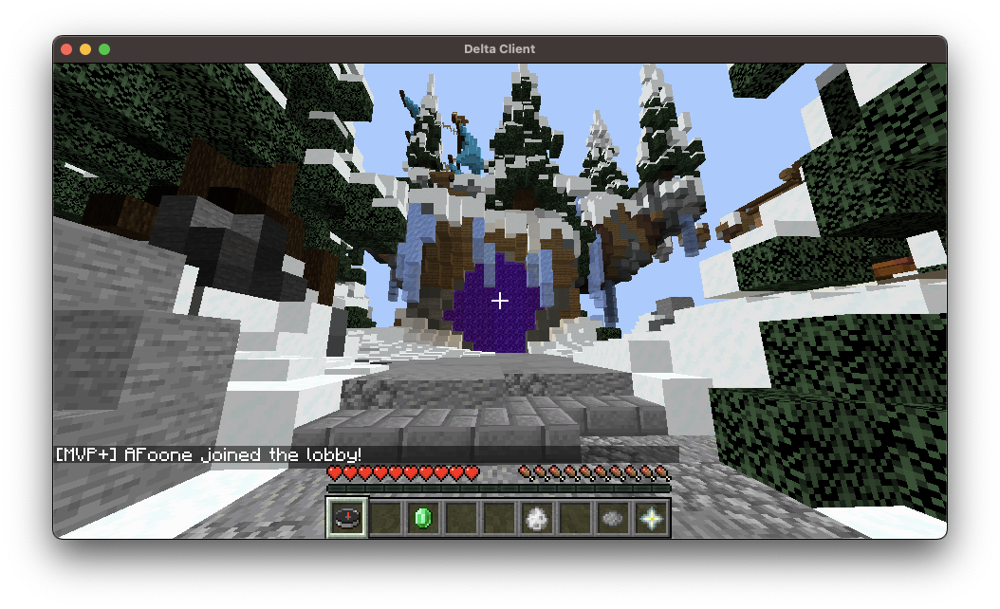
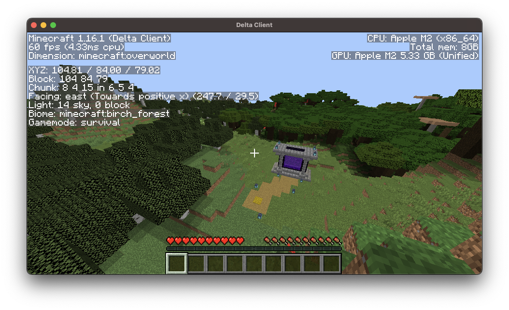
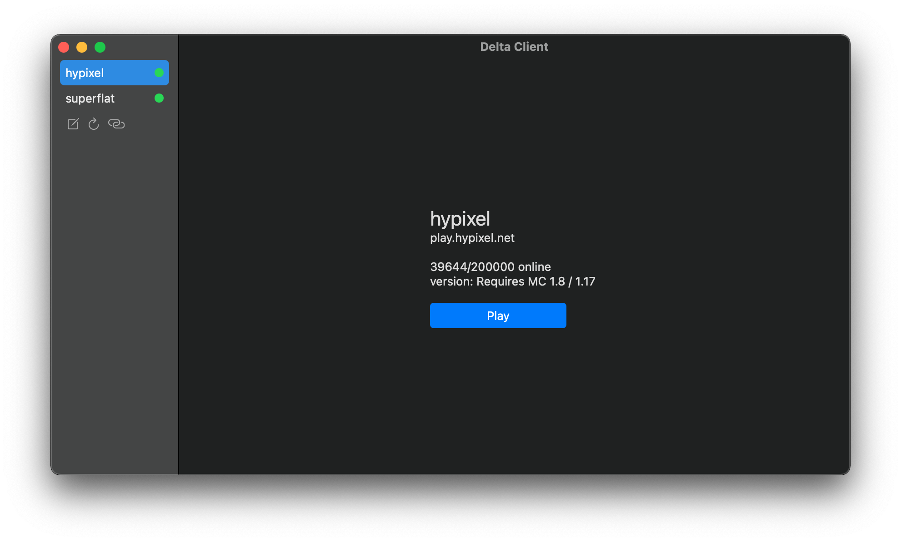

# Delta Client - Changing the meaning of speed

[](https://discord.gg/xZPyDbmR6k)

An open source rewrite of the *Minecraft: Java Edition* client, written in Swift for macOS and iOS (experimental). Currently Delta Client only supports connecting to **1.16.1** servers.

## Disclaimers

This client is not finished yet. If you're looking for a client to use to play Minecraft today, then this is not for you. **I am NOT responsible for anti-cheat bans, the client has not been thoroughly tested yet and is still deep in development.**

**This software is not affiliated with Mojang AB, the original developer of Minecraft.**

## Overview

The main focus of this project is to create a highly efficient Java Edition compatible client written in Swift for macOS. The client also has experimental support for iOS, and is in the process of getting ported to Linux using SwiftCrossUI and eventually Kinzoku (once it is ready).

If you want to have a say in the development of the client or have any questions, feel free to join the community on [Discord](https://discord.gg/xZPyDbmR6k).



## Performance

One of the biggest advantages of Delta Client is its performance. Epic comparison graphs are in progress, but for now have some dot-points.

- Start-up time:
  - M2 MacBook Air: 0.9 seconds (vanilla takes 43 seconds)
  - i5 MacBook Air: 2.7 seconds (vanilla takes ~60 seconds)
- FPS on 10 render distance in the mountains (bad for fps):
  - M2 MacBook Air (on 1080p monitor): ~120 fps (vanilla gets ~75 fps)
  - i5 MacBook Air: ~70 fps (vanilla gets ~35fps)

## Installation

### Prebuilt

1. Visit [Delta Client's downloads page](https://delta.stackotter.dev/downloads) and download the
   latest build from the `main` branch.
2. Unzip the downloaded zip archive and open the app inside
3. You will get a security alert, click ok
4. Right click the app in finder and select open
5. You should get another pop-up, click 'Open'
6. Delta Client will now open and start downloading the required assets (this only has to happen once and should take around 40s with a mediocre internet speed)
7. You can move Delta Client to your Applications folder for ease of use if you want

To view application logs, click `View > Logs` in the menu bar while Delta Client is open.

### Building from source

To build Delta Client you'll first need to install Xcode 14, [homebrew](https://brew.sh), and the latest version of [Swift Bundler](https://github.com/stackotter/swift-bundler). Please note that using Xcode 13 is ok but you may run into some weird memory corruption issues, so test with Xcode 14 before assuming that it's a Delta Client bug. Once you've installed the requirements, run the following commands in terminal;

```sh
# Clone Delta Client
git clone https://github.com/stackotter/delta-client
cd delta-client

# gtk isn't required for building the regular UI, but SwiftPM will still fail even if you're
# building the SwiftUI-backed UI because it's a bit conservative about dependencies.
brew install gtk4

# Perform a release build and output the bundled app to the current directory
sh ./build.sh

# If you want to develop Delta Client using Xcode, run the following command
swift bundler generate-xcode-support
# And then open Package.swift with Xcode and you'll be able to build it from Xcode too
```

## Minecraft version support

At the moment the client only supports joining **1.16.1** servers. In the future I plan to support more versions. 

Not every version will be perfectly supported but I will try and have the most polished support for the following versions;

- 1.8.9
- the latest speedrunning version (currently 1.16.1)
- the latest stable version

## Features

- [x] Networking
  - [x] Basic networking
  - [x] Server list ping
  - [x] Encryption (for non-offline mode servers)
    - [x] Mojang accounts
    - [x] Microsoft accounts
  - [x] LAN server detection
- [x] Basic config system
  - [x] Multi-accounting
- [ ] Rendering
  - [x] World
    - [x] Basic block rendering
    - [x] Basic chunk rendering
    - [x] Block culling
    - [x] Block models
    - [x] Multipart structures (e.g. fences)
    - [x] Multiple chunks
    - [x] Lighting
    - [x] Animated textures (e.g. lava)
    - [x] Translucency
    - [x] Fluids (lava and water)
    - [x] Chunk frustum culling
    - [x] Biome blending (mostly)
  - [ ] Entities
    - [x] Basic entity rendering (just coloured cubes)
    - [ ] Render entity models
    - [ ] Entity animations
    - [ ] Block entities (e.g. chests)
    - [ ] Item entities
  - [ ] GUI
    - [x] Chat
    - [x] F3-style stuff
    - [ ] Bossbars
    - [ ] Scoreboard
    - [x] Health, hunger and experience
    - [x] Hotbar
    - [ ] Inventory
      - [ ] Basic inventory
      - [ ] Basic crafting
      - [ ] Inventory actions
      - [ ] Using recipe blocks (like crafting tables and stuff)
      - [ ] Creative inventory
- [ ] Sound
  - [ ] Basic sounds system
- [x] Physics
  - [x] Physics loop
  - [x] Input system
  - [x] Collision system
- [ ] Interaction
  - [x] Block placing
  - [ ] Block breaking
  - [ ] Block entity interaction
  - [ ] Entity interaction
- [ ] Particles
  - [ ] Basic particle system
  - [ ] Block break particles
  - [ ] Ambient particles
  - [ ] Hit particles
  - [ ] Particles from server

## Contributing

First, please check out the [contributing guidelines](Contributing.md). Then you can checkout the [issues](https://github.com/stackotter/delta-client/issues) for a place to get started. Make sure to leave a comment on the issue you choose so that people know that someone's already working on it.

## Servers

We now have an official testing server (`play.deltaclient.app`)! However, if you want to mess around to your hearts content you can run a server on your computer for full control (see below).

To start a test server, download a 1.16.1 server jar from [here](https://mcversions.net/download/1.16.1). Then in Terminal type `java -jar ` and then drag the downloaded .jar file onto the terminal window and then hit enter. Wait for the server to start up. Now add a new server with the address `localhost` in Delta Client and you should be able to connect to it. Keep in mind the server may use a significant amount of resources and slow down Delta Client.

## More screenshots




